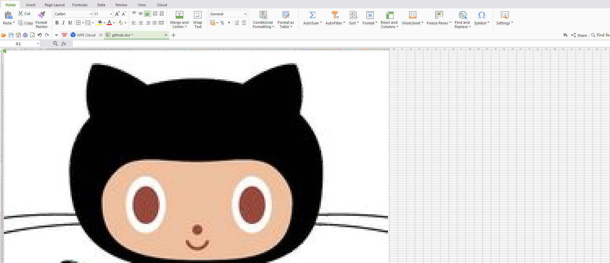

# Excel Art

Convert any image into Excel sheet by converting each pixel as an excel cell

## Tech Stack
Project build using python

## Installation
pip install -r requirements.txt

## Usage
- Place the image in `images` folder
- run the command:
```
python testImage.py <image_name>
```

## Processing
Example
```
$ python testImage.py github.jpg                                                                                                                                                                                              
Drawing: |██████████████████████████████████████████████████| 100.0% Complete

Art Sheet is saved Successfully...
```

## Output
You can find your excel sheet in `arts` folder

